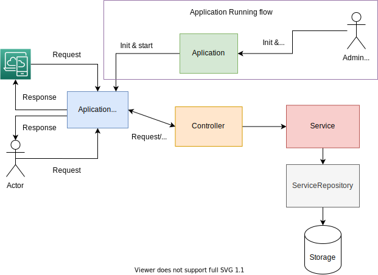

# Releasin challenge

A proposed implementation of production management over an HTTP REST API.

## Development Part

If you want to get your hand dirty, you can start by cloning this repository, Altghouh the goal was to setup docker-compose configuration for quick devlopement, the only dependency is `Postgres`, create a database name `releasin_app`.

    git clone https://github.com/samyouaret/releasin-challenge-api.git

you can use the same instructions as in the Running the application section or install `nodejs` and yarn (recommended) and you are ready to go.

Create an `.env` file:

    cp .env.example .env


Run the migration

    yarn run migrate

Start the application

    yarn run start

To run tests

    yarn run test

You can run only units tests

    yarn run test:unit

The same could be applied to run E2E tests

    yarn run test:e2e

### Application endpoints

The application should be server on port `3000` where the host in local is  [api](https://localhost:3000)

All Endpoints are served with the prefix `/api/`, There are four endpoints:

1. Endpoints for products are on namespace `/api/products`.
2.Endpoints for products Types are on namespace `/api/products-types`.
3. Endpoints for attributes are on namespace `/api/attribute`.
4. Endpoints for Assigned attributes are on namespace `/api/assigned-attributes`.

A swagger documentation is supposed to be found on local host after running the application [api docs](https://localhost:3000/api/docs), but the documentation is not setup.

A Basic **Postman** collection is available in `docs/postman`, import to postman so you can quickly interact the endpoints.

## Application structure

While making it work is good, making it maintainable and testable is more important. The application structure is a clean(we strive to) layered architecture with respect to the **SOLID** principles.

Each layer serves a specific purpose, the ultimate goal is to make each layer replaceable and testable on its own without the need for setting up the application.

Testability for just enough purpose is maintained in the application architectures, Built-in quality is a must, not a luxury.

In summary, this application should allow us at least to do the following steps without breaking down the application.

1. We can Test all parts in isolation.
2. Any Part(usually a layer) should be replaceable.
3. we should not struggle with refactoring.
4. Databases, and HTTP servers are just details.

Regrading the fourth(4) point the goal is the delay decisions 
about HTTP servers, databases choices, they should be pluggable into our architecture, not a dependency.

We talked too much so far, the picture below represents the application structure.




Describing the Application architecture, we can see the HTTP server acts just as a **Gateway** for our application, it is not a dependency by itself, Actionly it was the last thing to implement and add the end-to-end testing for the endpoints.

Controllers interact with Application Gateway(HTTP server), and **service**, it uses services to serve those requests.
Services hold the business logic, although our application has only a few concerns at the moment all business logic should happen in services.

**Repositories** Acts as the **gateway** to access data, it uses Stores(it could be a database as well as it could a file system or in-memory data), Datastore should be replaceable.

To keep dependency as low as possible, the dependency injection follows one direction from Top to down, Contracts(interface) should be set the boundaries and relationships between each layer.

Back to the root application, it is the starting point to run the application, it manages an **Application gateway** which in our case is the HTTP server.

As a concrete example of an HTTP server, we are using **expressjs**.


## Decomposing Project folder structure

All the project code resides in the `src` folder, it is written in typescript, when building the project a `build` folder is produced containing transpiled javascript.

Typescript has more type-safety than javascript, it helps to show more semantics in code, also interfaces help us define our boundaries and abstraction.

```
src
├── Application.ts
├── bootstrap.ts
├── config
│   └── server.config.ts
├── contracts
│   ├── ApplicationGateway.ts
│   ├── Initiable.ts
│   ├── Startable.ts
│   └── StoreInteface.ts
├── database
│   ├── InMemoryStore.ts
│   └── JsonStore.ts
├── factory
│   ├── createApplication.ts
│   ├── createHttpServer.ts
│   ├── createInMemoryStore.ts
│   └── createJsonStore.ts
├── helpers
├── http
│   ├── HttpServerGateway.ts
│   └── controllers
│   └── routes
├── index.ts
├── repositories
│   ├── OrderRepository.ts
│   └── SupplierRepository.ts
├── services
│   ├── OrderService.ts
│   └── SupplierService.ts
└── tests
    ├── e2e
    │   ├── orders.test.ts
    │   └── suppliers.test.ts
    └── unit
        └── services
            ├── orders.test.ts
            └── suppliers.test.ts
```

the `Application` is the starting point of the application, bootstrap file and index help us just for a clean setup of the application.

`contracts` folder defines interfaces as a mechanism to decouple layers.

`factories` are functions that create and build different application components, like application, HttpServer, Database Stores.

All business logic is found in the `services` folder, each business has its corresponding service.

Accessing data is done via `repositories` that use `stores` in the `database` folder.

`config` and `helpers` give a more clean approach to reuse some functions and configurations.

`http` folder contains the `HttpGateway` a server gateway for our application that implements the `ApplicationGateway` contract with routes and the `controllers` folder that contains handlers responsible to handle HTTP requests and sending back responses that are mainly provided by `services`.

`tests` contains tests for our application components, each nested test folder has a correspondent run command eg. `yarn run test:2e2`.

## PinPoints and considerations

Some pinPoints faced when tinkering around the challenge wereThe hierarchy structure of relations, and Typevalue many types in one table.

for hierarchy structure the product management is more like settings so a NoSQL database would fit better in this case, other parts could still use a relational database.

Type value could be separated, each type value should have its own table, or a general approach would be serializing the value and type in string format but yet we should care about search capabilities, considering the capabilities of native types supported by databases.